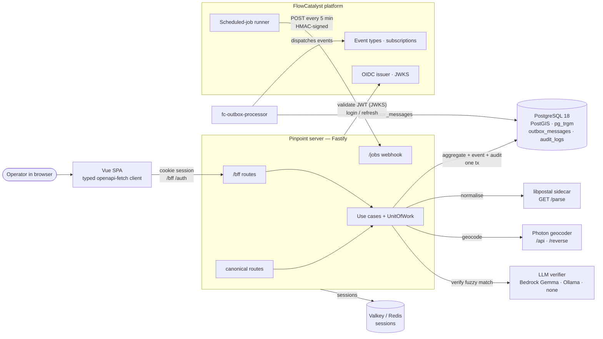
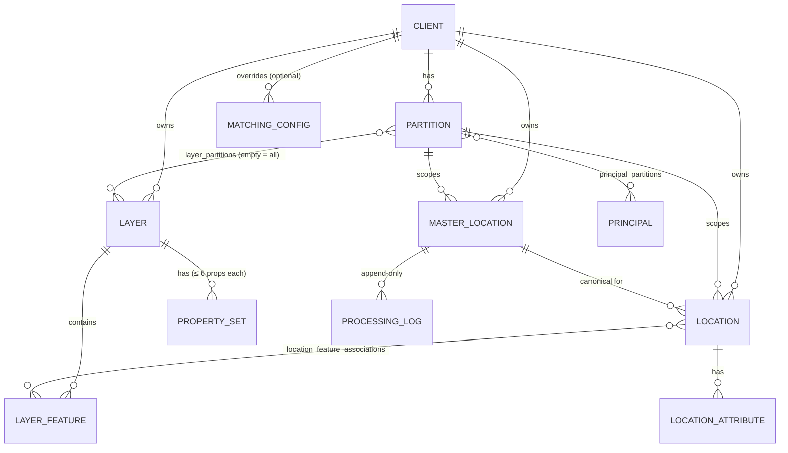
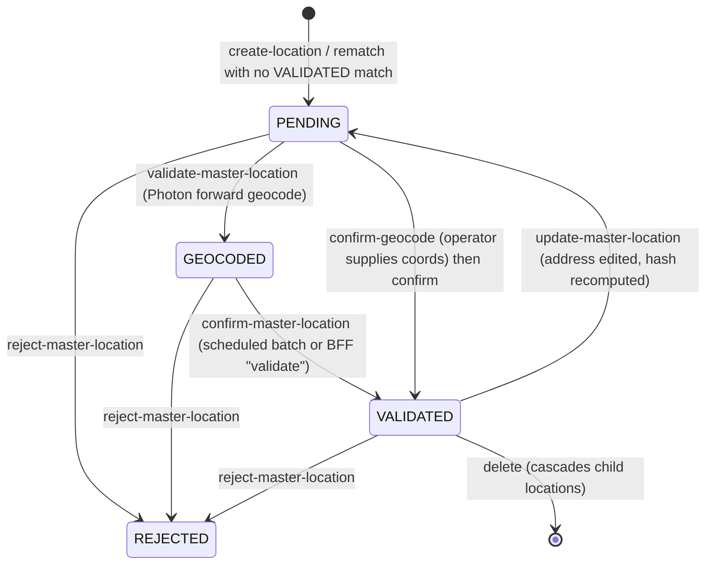
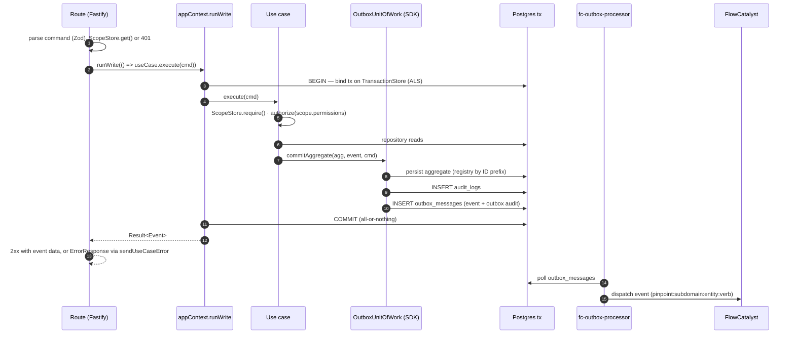
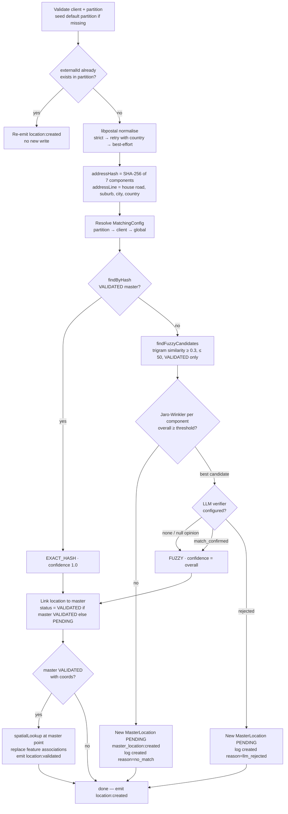
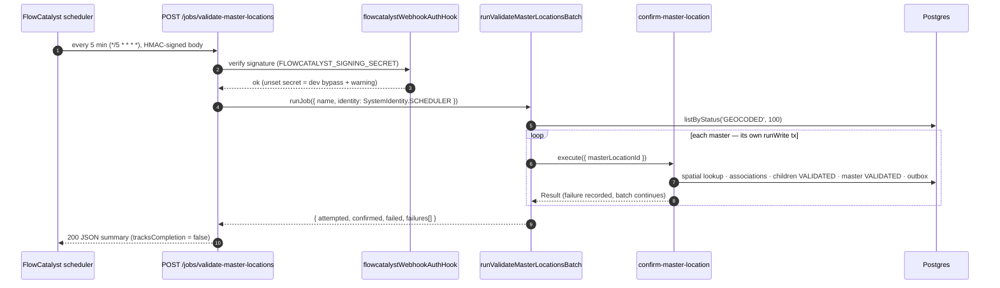
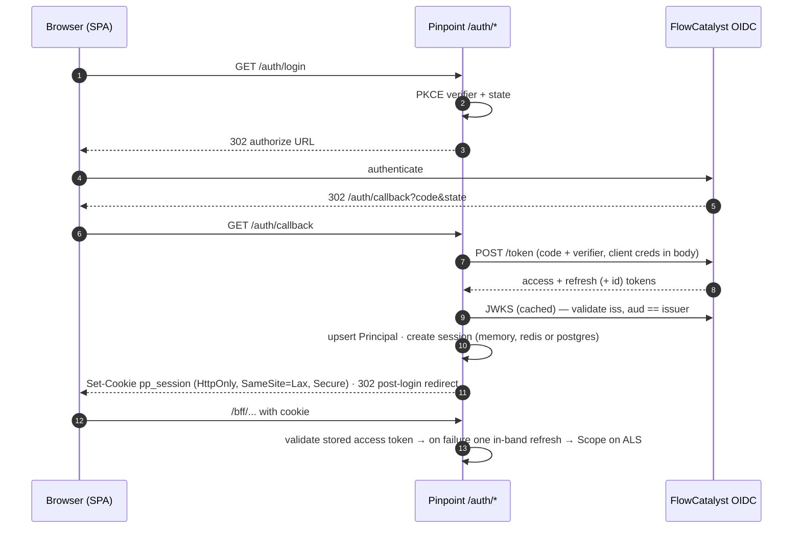
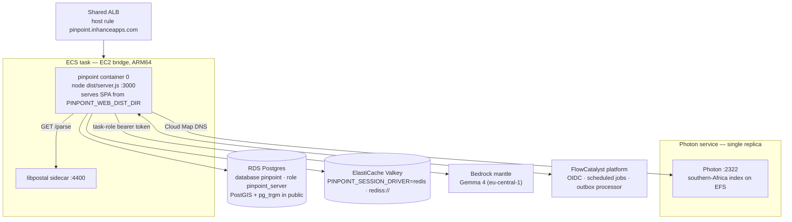

# Pinpoint — Architecture

> Spatial geocoding + address-matching service for the FlowCatalyst platform. This document describes the system as built in `apps/pinpoint/` on 2026-08-22 (commit `d14073e`); the pickup notes in [HANDOFF.md](HANDOFF.md) and the coding conventions in [../CLAUDE.md](../CLAUDE.md) complement it. Diagrams are Mermaid — GitHub renders them inline.

**Contents** — [What pinpoint does](#1-what-pinpoint-does) · [System context](#2-system-context) · [Code structure](#3-code-structure-and-layering) · [Domain model](#4-domain-model) · [The write path](#5-the-write-path) · [Process flows](#6-process-flows) · [HTTP surface and contracts](#7-http-surface-and-contracts) · [Identity and permissions](#8-identity-and-permissions) · [Platform integration](#9-flowcatalyst-platform-integration) · [Deployment](#10-deployment) · [Data, indexes and migrations](#11-data-indexes-and-migrations) · [Configuration](#12-configuration-reference) · [Testing and tooling](#13-testing-and-tooling) · [Known gaps](#14-known-gaps-and-divergences)

---

## 1. What pinpoint does

Pinpoint turns raw customer addresses into **canonical, geocoded master locations** and overlays business meaning on them through **layers** (sales territories, delivery zones, geofences). A customer (`Client`) uploads or creates locations; pinpoint normalises the address (libpostal), deduplicates it against existing master locations (hash + trigram/Jaro-Winkler fuzzy match, optionally LLM-verified), geocodes the master (Photon), confirms it, and associates it with every layer feature whose boundary contains the point (PostGIS). Every state change is a domain event published to FlowCatalyst through the transactional outbox.

| Fact | Value |
| --- | --- |
| Runtime | Node 24 · Fastify 5 · TypeScript 6 (strict) · Drizzle ORM 1.0 RC · PostgreSQL 18 + PostGIS + pg_trgm |
| SPA | Vue 3 + PrimeVue + Vite, served by the same server in prod |
| Surfaces | canonical API `/clients/…` + unscoped; BFF `/bff/…` for the SPA — **101 operations**, one OpenAPI 3 contract (`openapi.gen.json`) |
| Domain | 9 aggregates, **25 use cases**, **27 domain event types**, 34 permissions, 6 platform roles |
| Platform | OIDC login against FlowCatalyst; events via outbox → `fc-outbox-processor`; one scheduled job (`pinpoint-validate-master-locations`, every 5 min) |
| External services | libpostal sidecar (normalisation), Photon (forward/reverse geocoding), LLM verifier (Bedrock Gemma / Ollama / none) |

## 2. System context



The server is the only writer to the database. The SPA never talks to the platform directly; authentication is a server-side OIDC flow that ends in an HttpOnly session cookie. The platform reaches back into pinpoint in exactly one place — the HMAC-signed scheduled-job webhook.

## 3. Code structure and layering

```
apps/pinpoint/
├── shared/      @pinpoint/shared     Zod command schemas, PinpointPermission catalog
├── framework/   @pinpoint/framework  re-exports app-framework + the SDK's non-Effect UoW surface
├── server/      @pinpoint/server
│   └── src/
│       ├── domain/          aggregates, repository interfaces, domain events, pure services (matcher, hash)
│       ├── operations/      25 use cases — one directory each
│       ├── infrastructure/  Drizzle repositories, schema, external-service clients, migrations
│       ├── api/             routes (canonical + bff), plugins (error mapper, shared schemas, webhook auth)
│       ├── auth/            OIDC client, token validator, session stores, permission resolution
│       ├── scheduling/      validate-master-locations batch handler
│       ├── flowcatalyst/    event types, roles, dispatch pool, scheduled job definitions
│       ├── app-context.ts   composition root — wires repos, services, use cases, runWrite
│       └── server.ts        Fastify bootstrap (hooks, swagger, routes, static SPA)
└── web/         @pinpoint/web        Vue SPA; src/api/client.ts + schema.gen.d.ts (generated)
```

Dependency direction is strictly inward: `api → operations → domain ← infrastructure`. Routes are thin shells (parse → `runWrite(() => useCase.execute(cmd))` → map `Result`). Use cases are plain `async` classes with constructor-injected dependencies; there is no DI container and no Effect runtime (pinpoint deliberately diverges from fulfil there — see CLAUDE.md).

Identity travels on an `AsyncLocalStorage` `Scope` (bound in the `onRequest` hook), so use cases call `ScopeStore.require()` rather than receiving a principal parameter.

## 4. Domain model

| Aggregate | ID | Lifecycle | Notes |
| --- | --- | --- | --- |
| **Client** | `cli_` | `ACTIVE` / `SUSPENDED` | tenancy root; creating one seeds a `default` partition |
| **Partition** | `par_` | — | sub-tenant inside a client (`code` unique per client); layers can be scoped to partitions |
| **Principal** | `prn_` (IdP `sub`) | — | upserted on login; `principal_partitions` grants (BFF direct writes) |
| **Layer** | `lyr_` | `ACTIVE` / `INACTIVE` | `RADIUS` / `POLYGON` / `POINT`; PostGIS `boundary` geometry (GIST); `layer_partitions` (empty = visible to all partitions) |
| **LayerFeature** | `lfe_` | `ACTIVE` / `INACTIVE` | a region inside a layer with `boundary` and ≤ 6 `propertyValues`; `location_feature_associations` link locations to features |
| **PropertySet** | `pst_` / `prp_` | — | named set of ≤ 6 key/value properties on a layer |
| **Location** | `loc_` | `PENDING` → `VALIDATED` | a customer's raw address; `rawAddressLine1` immutable, `matchAddress` editable; `matchMethod` `EXACT_HASH` / `FUZZY`; `location_attributes` (insert-only) |
| **MasterLocation** | `mlo_` | `PENDING` → `GEOCODED` → `VALIDATED`, any → `REJECTED` | canonical deduplicated address; SHA-256 `addressHash`, `normalizedAddressLine` (trigram index), `point` geometry; `processing_log` append-only trail |
| **MatchingConfig** | `mcf_` | — | thresholds, resolved partition → client → global default |
| Country (read model) | int | — | seeded; ISO codes + geometry |



### Master location lifecycle



Only **VALIDATED** masters are ever candidates for matching. A child `Location` is `PENDING` until its master is confirmed, at which point `confirm-master-location` flips every child to `VALIDATED` and emits one `location:validated` per child.

## 5. The write path

Every state change goes through one shape. The sealed `Result<T>` from the SDK is the type-level gate: a use case cannot construct a success without going through the unit of work, so an aggregate write can never be committed without its event and audit row.



Cascades (e.g. `confirm-master-location` validating N children, `delete-client` removing partitions) are repeated `commitAggregate` calls inside the same `runWrite` transaction; the first failure short-circuits and rolls everything back.

## 6. Process flows

### 6.1 Create location — the matching pipeline

`POST /clients/{id}/locations` (or `/bff/…`) → `create-location` use case. Constants: fuzzy candidate threshold `similarity ≥ 0.3`, at most 50 candidates; Jaro-Winkler per component after an 80-entry substitution table (street-type abbreviations, Afrikaans → English, ZA city aliases); thresholds from the resolved `MatchingConfig` (defaults: street 0.85, house number 1.0, postal 0.95, state 0.9, address name 0.8, overall 0.85).



Every step appends to the master's `processing_log` (`normalized`, `matched` / `created`, `llm_verified`, …). Attributes on the command are inserted on the same transaction.

### 6.2 Geocode and confirm — the master-location lifecycle

Two use cases move a master forward; the second can run from the UI or from the scheduled batch.

1. **validate-master-location** (permission `master_location:validate`, BFF "geocode"): requires `PENDING`; Photon forward geocode of the normalised address line (rate-limited token bucket, default 5 rps); stores lat/lon + confidence → `GEOCODED`; emits `master_location:geocoded`.
2. **confirm-master-location** (permission `master_location:confirm`, BFF "validate"): requires coordinates; runs `spatialLookup` at the master's point, replaces `location_feature_associations` for **every child location**, flips children to `VALIDATED`, master → `VALIDATED` with `validatedAt`; emits `master_location:validated` + one `location:validated` (with `layerProperties[]`) per child; logs `validated`.

Operator shortcuts in the BFF: **reverse-geocode** (Photon `/reverse`, read-only suggestion) and **confirm-geocode** (operator-supplied components + coordinates written directly, logged as `confirm-geocode`, then confirm).

### 6.3 Scheduled validation batch



The job is declared in `server/src/flowcatalyst/scheduled-jobs.ts` and registered by `pnpm flowcatalyst:sync` (`concurrent: false` → one firing at a time across replicas; the batch itself is sequential by design).

### 6.4 Rematch

`rematch-location` sets a new `matchAddress` and re-runs normalisation + matching. A `VALIDATED` match re-points the location and validates it (spatial associations, `location:validated`); otherwise a new `PENDING` master is created. The previous master is deleted only if it was `PENDING` **and** has no other children. Emits `location:rematched { previousMasterLocationId, masterLocationId, … }`.

### 6.5 Spatial lookup and feature association

One SQL shape (`layer-feature-repository.ts`) serves `POST …/spatial-lookup`, confirm, and the BFF "match features":

- point = `ST_SetSRID(ST_MakePoint(lon, lat), 4326)`
- a layer is visible to a partition if it has **no** `layer_partitions` rows or one for that partition; optional `layer.code IN (…)`
- `ST_Intersects(layer_features.boundary, point)` for containment; `ST_Distance(boundary::geography, point::geography)` as `distanceMeters`; ordered per layer by distance; `ACTIVE` features only.

"Match features" (single or bulk per client) rewrites `location_feature_associations` for each child of a master directly through the repository — no use case, no event (see §14).

### 6.6 Login, session and per-request identity



Per-request identity precedence (`server.ts` `extractRequestToken`): `Authorization: Bearer <JWT>` → `pp_session` cookie (with one refresh attempt on expiry) → `x-user-id` dev fallback (only when `PINPOINT_AUTH_DEV_FALLBACK=true`; grants every permission) → anonymous (routes answer 401). The SPA treats a 401 from `/auth/me` as "logged out"; the error middleware redirects to `/auth/login` only on 401, never on 403.

## 7. HTTP surface and contracts

| Surface | Prefix | Consumers | Shape |
| --- | --- | --- | --- |
| Canonical API | `/clients/{clientId}/…`, unscoped `/me`, `/countries`, `/geocode/*`, `/verify-match`, `/master-locations/unvalidated`, `/jobs/*`, `/health` | integrations, scripts | mirrors the original Rust API; `PATCH` for updates |
| BFF | `/bff/…` (52 ops) | the Vue SPA | UI-shaped payloads, `q` search + pagination on lists, operator actions (geocode / reverse-geocode / confirm-geocode / validate / match-features / processing-log, partition principals, layer partitions, feature status, dashboard) |
| Auth | `/auth/login`, `/auth/callback`, `/auth/logout`, `/auth/me` | browser | OIDC + session cookie |

**Contract pipeline.** Every route carries a TypeBox schema and a unique `operationId`; `@fastify/swagger` derives the OpenAPI document, `pnpm openapi:pinpoint` exports it to `apps/pinpoint/openapi.gen.json` and regenerates `web/src/api/schema.gen.d.ts` (`openapi-typescript`); `pnpm openapi:pinpoint:check` fails CI-style when either is stale. Shared shapes are `$id` schemas listed in `api/plugins/shared-schemas.ts` and become `components.schemas` (12 today: `ErrorResponse`, `BffClient`, `BffPartition`, `BffLayerDetail`, `BffLayerPropertySet`, `BffLayerFeature`, `BffLayerFeatureInput`, `BffFeatureAssociation`, `BffMasterLocation`, `MatchingConfig`, `RematchLocationBody`, `RematchLocationResponse`). The SPA consumes the contract through `web/src/api/client.ts` (`api` = openapi-fetch, `ok()`, `ApiResponse<>`); there is deliberately no untyped escape hatch.

**Error envelope** (every 4xx/5xx): `{ error, message?, code?, details?, issues? }` — `error` is the use-case error type (`validation`, `authorization`, `not_found`, `business_rule`, `concurrency`, `infrastructure`) or a route guard (`Unauthorized`, `NotFound`, `ValidationError`, `Bad Request`).

**SPA routes** (`web/src/router/index.ts`): `/dashboard`, `/clients` (+ `/new`, `/:id`), `/partitions` (+ `/:id`), `/locations` (+ `/new`, `/:id`), `/master-locations` (+ `/unvalidated`, `/:id`), `/layers` (+ `/map`, `/new`, `/:id`), `/matching-config`, `/spatial-lookup`. Create pages and spatial lookup are guarded by permissions client-side; the server re-checks every call.

## 8. Identity and permissions

- **Catalog** — 34 `pinpoint:*` permissions in `@pinpoint/shared` (`PinpointPermission`): `auth:principal:read`, `reference:country:read`, `tenancy:{client,partition}:{create,read,update,delete}`, `locations:location:{create,read,update,delete}`, `locations:master_location:{read,validate,confirm,update,reject,delete}`, `layers:{layer,feature,property_set}:{create,read,update,delete}`, `matching:config:{read,manage}`, `matching:spatial:lookup`.
- **Roles synced to the platform** (`flowcatalyst/roles.ts`): `admin` (all), `operator`, `layer-manager`, `matching-admin`, `tenancy-admin`, `viewer` (all `*:read` + spatial lookup). The platform expands a principal's roles into the token's `scope` claim.
- **Resolution** (`auth/role-permissions.ts`): anchors (`all_applications`, `tier == ANCHOR`, `clients` contains `*`, or role ∈ `platform:super-admin` / `pinpoint:super-admin` / `pinpoint:admin`) get the whole catalog; everyone else gets `scope ∩ catalog`. Each use case declares `static requiredPermission` and checks `scope.permissions.has(...)`.
- **Token contract** — access tokens carry `aud == iss == platform base URL`; pinpoint validates against the discovery issuer unless `OIDC_AUDIENCE` overrides.

## 9. FlowCatalyst platform integration

| Mechanism | Direction | Detail |
| --- | --- | --- |
| **Definitions sync** | pinpoint → platform (script) | `pnpm flowcatalyst:sync` (client-credentials service account `FLOWCATALYST_API_CLIENT_ID/SECRET`) pushes the `DefinitionSet`: application `pinpoint`, 27 event types (`code`, `name`, `description`), dispatch pool `pinpoint-default`, 6 roles, 1 scheduled job; then pushes each event's TypeBox payload schema as a spec version (`addSchemaVersion`, minor-bumped, `1.0.0` first) only when the shape changed. Idempotent. |
| **Events** | pinpoint → platform (runtime) | outbox rows written in the use-case transaction; `fc-outbox-processor` dispatches them. Codes `pinpoint:<subdomain>:<entity>:<verb>` across tenancy (6), layers (10), locations (10), matching (1). |
| **Scheduled job** | platform → pinpoint | `pinpoint-validate-master-locations`, `*/5 * * * *` UTC, `targetUrl = <PINPOINT_PUBLIC_BASE_URL>/jobs/validate-master-locations`, HMAC with `FLOWCATALYST_SIGNING_SECRET`, non-concurrent. |
| **Identity** | pinpoint → platform | OIDC login + JWKS validation; roles → scope. |
| **Subscriptions** | — | none today (`subscriptions.ts` returns `[]`); pinpoint publishes but does not consume platform events. |

State on **fc-dev** after the 2026-08-22 sync: 27 pinpoint event types, each with schema version `1.0.0`; scheduled job `sjb_…` `ACTIVE`; a second run reports `pushed=0 skipped=27`.

## 10. Deployment

Production runs on the inhance AWS account (Pulumi in `inhance/iac`, image build + deploy in `inhance/flowcatalyst-deploy`); this repo ships the container and the env contract.



- **Image**: multi-stage `node:24-alpine`; builds SPA + server workspaces; runtime `node --conditions=compiled dist/server.js`; `/health` for the ALB.
- **Migrations on boot** when `PINPOINT_DB_AUTO_MIGRATE=true`: the SDK's `outbox_messages` DDL, then Drizzle migrations, serialised across replicas with `pg_advisory_lock`.
- **Local / compose**: `compose.yaml` runs only the libpostal sidecar (DB = fc-dev's embedded Postgres on `:15432`); `compose.prod.yaml` is a self-contained single-host stack (PostGIS container + libpostal + pinpoint, public Photon, memory sessions) — a fallback topology, not the ECS one. `photon/` holds the Nominatim → Photon index build for ZA/NA/BW/ZW/MZ/LS/SZ.

## 11. Data, indexes and migrations

| Concern | Mechanism |
| --- | --- |
| Spatial | `geometry` custom Drizzle type (`codec: 'text'`, see `docs/spatial-queries.md`); GIST on `layers.boundary`, `layer_features.boundary`, `master_locations.point`, `countries.geometry` |
| Fuzzy candidates | `pg_trgm` GIST on `master_locations.normalized_address_line` (`similarity(...) ≥ 0.3 ORDER BY similarity DESC`) |
| Free-text search (`q`) | GIN trigram **expression** index per table (`idx_{layers,locations,master_locations}_search_trgm`) over a concatenated search text; the repository filters with the identical expression (`layerSearchText` / `locationSearchText` / `masterLocationSearchText`) so the planner uses it |
| Dedup | `idx_locations_address_hash` (client, partition, hash), partial unique `idx_locations_external_id`; `master_locations.address_hash` |
| Outbox / audit | `outbox_messages` (SDK DDL) + `audit_logs` (app-framework), written in the use-case tx |
| Sessions | `sessions` table when `PINPOINT_SESSION_DRIVER=postgres` |
| Migrations | `server/drizzle/*` (6 folders); `pnpm db:generate` from the Drizzle schema; seed migrations via `drizzle-kit generate --custom` |

## 12. Configuration reference

| Variable | Purpose |
| --- | --- |
| `PORT`, `HOST`, `LOG_LEVEL` | Fastify listen + Pino level |
| `PINPOINT_PUBLIC_BASE_URL` | browser-facing base; OIDC redirect base; scheduled-job `targetUrl` base |
| `DATABASE_URL` **or** `DB_HOST/DB_PORT/DB_NAME/DB_USER/DB_PASSWORD` (+ `PINPOINT_DB_SSL=require\|no-verify`) | Postgres connection (prod: dedicated `pinpoint` DB, static non-rotated password) |
| `PINPOINT_DB_SCHEMA` (`public`), `PINPOINT_DB_AUTO_MIGRATE` | search_path pin; run migrations on boot |
| `OIDC_ISSUER_URL`, `OIDC_CLIENT_ID`, `OIDC_CLIENT_SECRET`, `OIDC_REDIRECT_URI`, `OIDC_SCOPES`, `OIDC_AUDIENCE` | OIDC (unset issuer = OIDC off) |
| `PINPOINT_AUTH_DEV_FALLBACK`, `PINPOINT_AUTH_POST_LOGIN_REDIRECT` | `x-user-id` dev identity (never in prod); post-login path |
| `PINPOINT_SESSION_DRIVER` (`memory\|redis\|postgres`), `PINPOINT_SESSION_REDIS_URL` | session store |
| `PINPOINT_LIBPOSTAL_URL` | libpostal sidecar (`http://localhost:4400`) |
| `PINPOINT_GEOCODING_API_URL`, `PINPOINT_GEOCODING_RATE_LIMIT` | Photon base URL; token-bucket rps (5) |
| `PINPOINT_LLM_PROVIDER` (`none\|bedrock\|ollama`), `PINPOINT_LLM_MODEL`, `PINPOINT_BEDROCK_REGION`, `PINPOINT_BEDROCK_BASE_URL`, `PINPOINT_OLLAMA_URL` | address-match verifier |
| `FLOWCATALYST_APPLICATION_CODE` (`pinpoint`), `FLOWCATALYST_SIGNING_SECRET`, `PINPOINT_DISPATCH_POOL` | outbox tenant; webhook HMAC; dispatch pool code |
| `FLOWCATALYST_URL`, `FLOWCATALYST_API_CLIENT_ID`, `FLOWCATALYST_API_CLIENT_SECRET`, `FLOWCATALYST_REMOVE_UNLISTED`, `PINPOINT_SCHEMA_SYNC` | `flowcatalyst:sync` script only |
| `PINPOINT_WEB_DIST_DIR` | serve the built SPA from the server (prod image sets it) |

## 13. Testing and tooling

- **Unit** (`pnpm test`, 189): matcher, hash/normaliser, verifier parsing, auth helpers, shared-schema guard.
- **Integration** (`pnpm test:integration`, 127, Docker): testcontainers PostGIS + Redis, migrations applied from `server/drizzle`, one test per use case through the real `runWrite`, repository tests (incl. search + count), OIDC end-to-end against a fake IdP, session stores.
- **Typecheck** `tsc -p tsconfig.test.json` covers `src`, `test`, `scripts`. **Lint/format** via Vite+ (`pnpm check` at the workspace root).
- **Contract** `pnpm openapi:pinpoint` / `:check`; **platform** `pnpm flowcatalyst:sync`; **DB** `db:init`, `db:generate`, `db:migrate`; **dev** `pnpm dev:pinpoint` (server `:3100` + vite `:5173` proxying `/bff /api /auth /jobs`).

## 14. Known gaps and divergences

- `Location.status = MATCHED` and `matchMethod = MANUAL` exist in the type but are never assigned.
- Several BFF operator actions write through repositories **without** a use case or domain event: match-features (single/bulk), confirm-geocode's coordinate write, set-feature-status, set-layer-partitions, partition principal grant/revoke. They are audited only by the HTTP log.
- `subscriptions` is empty — pinpoint publishes but never consumes platform events.
- `compose.prod.yaml` describes a single-host stack, not the ECS topology in §10; the ECS wiring lives in `inhance/iac` + `inhance/flowcatalyst-deploy`.
- Where the `boundary` geometry is derived from radius/polygon on write was not located in the repository SQL during this review — worth pinning down before touching layer geometry.
